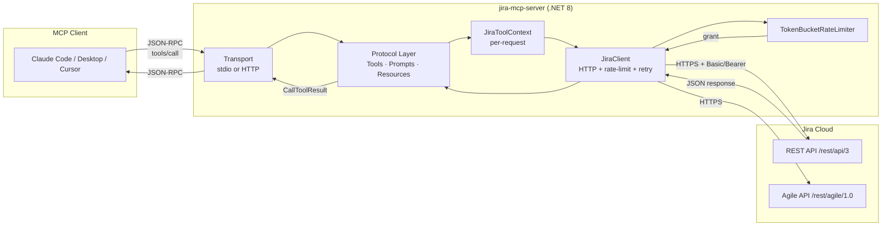
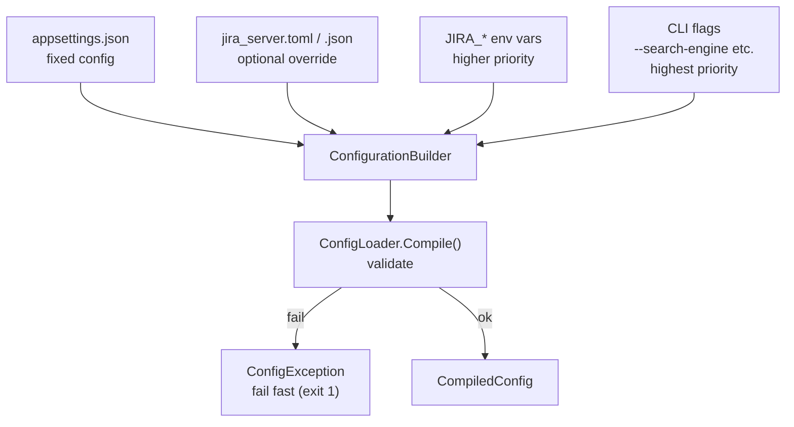
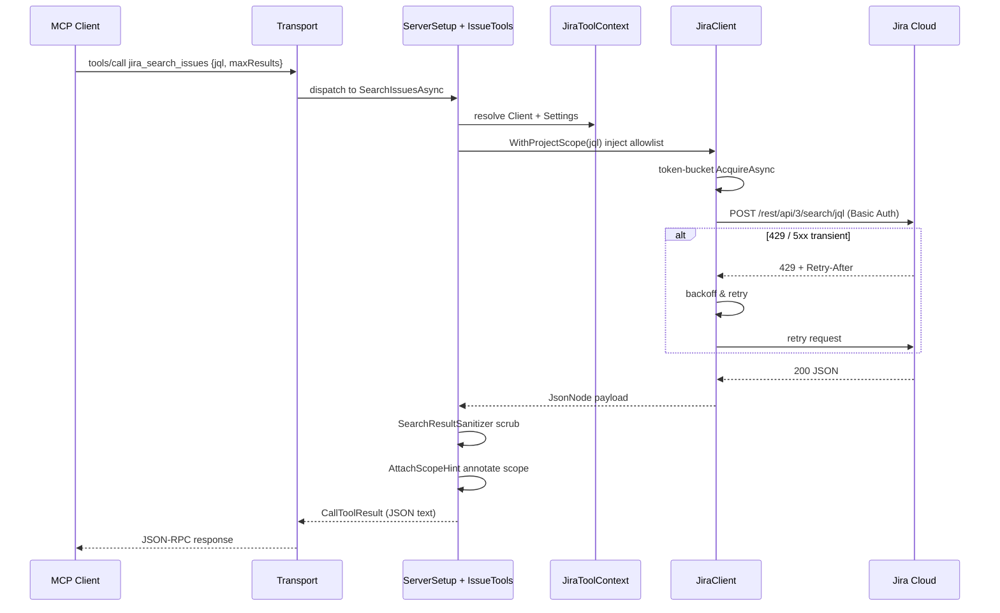
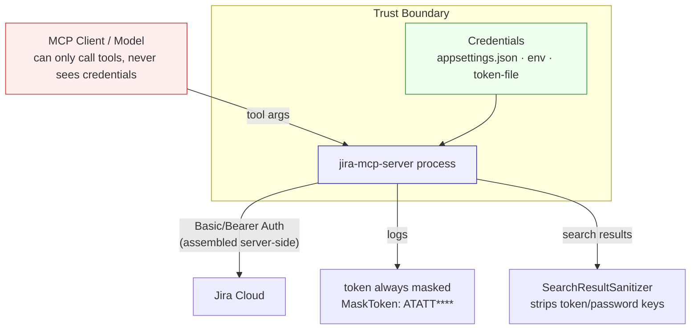

# Jira MCP Server (.NET)

[](LICENSE)
[](https://dotnet.microsoft.com/)
[](https://modelcontextprotocol.io/)

A Model Context Protocol (MCP) server for Jira, implemented in C# / .NET 8. It exposes the
Jira Cloud REST and Agile APIs as 27 MCP tools, 4 prompt templates, and 4 resources, so MCP
clients such as Claude Code, Claude Desktop, and Cursor can read and write Jira issues directly.

---

## Table of Contents

- [Features](#features)
- [Architecture & Interaction](#architecture--interaction)
- [Quick Start](#quick-start)
- [Configuration](#configuration)
- [Claude Code Setup](#claude-code-setup)
- [Tools Reference](#tools-reference)
- [Prompts & Resources](#prompts--resources)
- [Security Model](#security-model)
- [Transports](#transports)
- [Development](#development)
- [License](#license)

---

## Features

- **27 tools** — issue CRUD, search, comments, links, transitions, attachments, worklogs, boards/sprints
- **4 prompt templates** — bug report, sprint review, triage, daily standup
- **4 MCP resources** — projects, project meta, issue snapshot, transitions
- **Dual transport** — stdio (local, default) and Streamable HTTP (team-shared)
- **Server-side-only credentials** — never on the client command line or wire
- **Defense in depth** — project allowlist, JQL injection guard, tool-level permissions, token log masking
- **Resilience** — client token-bucket rate limiting + exponential backoff retry (with 429 Retry-After)
- **Config fixed in `appsettings.json`**, overridable by env vars and CLI

---

## Architecture & Interaction

### Overall Architecture



### Configuration Loading

The server merges configuration at startup; **later sources override earlier ones** (lowest to
highest priority). .NET's layered configuration natively lets environment variables override
`appsettings.json` values.



### Tool Invocation Lifecycle

Using `jira_search_issues` as an example, the full path from client invocation to result:



### Security Model



---

## Quick Start

### Prerequisites

- .NET SDK 8.0+ ([download](https://dotnet.microsoft.com/download))
- A Jira Cloud instance + API Token (create one at
  [https://id.atlassian.com/manage-profile/security/api-tokens](https://id.atlassian.com/manage-profile/security/api-tokens))

### 1. Fill in configuration

Edit `src/JiraMcpServer/appsettings.json`, replacing the placeholders with your real credentials:

```json
{
  "base_url": "https://your-domain.atlassian.net",
  "auth_method": "basic",
  "user_email": "you@your-domain.com",
  "api_token": "YOUR_JIRA_API_TOKEN",
  "project_keys": "",
  "tools": "",
  "search_engine": "jql",
  "rate_limit": 100,
  "request_timeout": 30,
  "connect_timeout": 10
}
```

### 2. Build & run

```bash
# build
dotnet build JiraMcpServer.slnx

# stdio mode (for local clients)
dotnet run --project src/JiraMcpServer -- --transport stdio

# HTTP mode (team-shared)
dotnet run --project src/JiraMcpServer -- --transport http --port 8080
```

### 3. Verify

```bash
# print version
dotnet run --project src/JiraMcpServer -- --version
# output: jira-mcp-server 0.2.0

# health check in HTTP mode
curl http://127.0.0.1:8080/health
# {"status":"healthy","server":"jira-mcp-server","version":"0.2.0","transport":"http","jira_configured":true}
```

---

## Configuration

All configuration keys are fixed in `appsettings.json`. .NET's layered configuration guarantees
**environment variables take precedence over the file**: if `api_token` is set in
`appsettings.json` and `JIRA_API_TOKEN` is also set in the environment, the env var wins.
CLI flags (e.g. `--search-engine`) have the highest priority.

### Configuration Keys

| Key | Env var | Description | Default |
|---|---|---|---|
| `base_url` | `JIRA_BASE_URL` | Jira URL, must be `https://` | — (required) |
| `auth_method` | `JIRA_AUTH_METHOD` | `basic` (email+token) or `bearer` | `basic` |
| `user_email` | `JIRA_USER_EMAIL` | account email for basic auth | required for basic |
| `api_token` | `JIRA_API_TOKEN` | Jira API token | — (required) |
| `project_keys` | `JIRA_PROJECT_KEYS` | write allowlist, comma-separated; empty = all | — |
| `tools` | `JIRA_TOOLS` | tool allowlist: `read,create,update,delete,write` or tool names | empty = all |
| `search_engine` | `JIRA_SEARCH_ENGINE` | `jql` (default) / `get` / `auto` (enhanced search/jql endpoint) | `jql` |
| `rate_limit` | `JIRA_RATE_LIMIT` | max requests per minute | `100` |
| `request_timeout` | `JIRA_REQUEST_TIMEOUT` | request timeout in seconds | `30` |
| `connect_timeout` | `JIRA_CONNECT_TIMEOUT` | connect timeout in seconds | `10` |

### Priority (low → high)

1. **`appsettings.json`** — fixed config, copied to the output directory at build time
2. **`jira_server.toml` / `jira_server.json`** — optional override, auto-discovered in cwd or exe directory
3. **`JIRA_*` env vars** — override file values
4. **CLI flags** — e.g. `--search-engine`, only overrides when explicitly passed

> 💡 **Credential safety:** the template `appsettings.json` is tracked, but credential-bearing
> variants (`appsettings.*.json`, `*.env`, `jira_server.toml`) are gitignored.

### CLI Flags

```
--transport <Transport>        stdio | http                         [default: stdio]
--token-file <token-file>       path to a KEY=VALUE credentials file
--search-engine <search-engine> jql | get | auto                     [default: jql]
--host <Host>                   HTTP bind host                        [default: 127.0.0.1]
--port <Port>                   HTTP bind port                        [default: 8080]
--auth-mode <Mode>              none | token                          [default: none]
--server-token <Token>          HTTP client bearer token
--cors-origins <Origins>        CORS origins, comma-separated         [default: *]
--log-level <Level>             DEBUG | INFO | WARNING | ERROR        [default: INFO]
--version                       print version & exit
```

---

## Claude Code Setup

### Option A: stdio mode (recommended locally)

Create a `.mcp.json` in your project root, or add to the `mcpServers` block of `~/.claude.json`:

```json
{
  "mcpServers": {
    "jira": {
      "command": "dotnet",
      "args": [
        "run",
        "--project",
        "E:/bs/code/others/jira_mcp_server_net/src/JiraMcpServer",
        "--",
        "--transport",
        "stdio"
      ]
    }
  }
}
```

Or use the built binary directly (faster startup):

```json
{
  "mcpServers": {
    "jira": {
      "command": "E:/bs/code/others/jira_mcp_server_net/src/JiraMcpServer/bin/Debug/net8.0/jira-mcp-server.exe",
      "args": ["--transport", "stdio"]
    }
  }
}
```

You can also add it via the CLI:

```bash
claude mcp add jira -- dotnet run --project E:/bs/code/others/jira_mcp_server_net/src/JiraMcpServer -- --transport stdio
```

### Option B: HTTP mode (team-shared)

First start the server:

```bash
dotnet run --project src/JiraMcpServer -- --transport http --port 8080 --auth-mode token --server-token "shared-secret"
```

Then configure `.mcp.json`:

```json
{
  "mcpServers": {
    "jira": {
      "type": "http",
      "url": "http://your-server:8080/mcp",
      "headers": {
        "Authorization": "Bearer shared-secret"
      }
    }
  }
}
```

### Verify the connection

In Claude Code, run:

```
/mcp
```

You should see the `jira` server and its 27 tools. Then converse naturally:

> "Search all unclosed bugs in project PROJ"

Claude will automatically call `jira_search_issues`.

---

## Tools Reference

All 27 tools, grouped by module. Each tool's parameters are exposed to clients via the MCP
`inputSchema`.

### Issues (14)

| Tool | Description |
|---|---|
| `jira_create_issue` | create issue, auto-converts text to ADF |
| `jira_update_issue` | update issue fields |
| `jira_get_issue` | get issue details, optional fields/expand |
| `jira_delete_issue` | delete issue (requires `confirm=true`) |
| `jira_transition_issue` | transition by id or target status |
| `jira_get_transitions` | list available transitions |
| `jira_add_comment` | add comment with optional visibility |
| `jira_get_comments` | paginated comments |
| `jira_link_issues` | link two issues |
| `jira_get_issue_links` | get issue links |
| `jira_search_issues` | JQL search, auto-injects allowlist |
| `jira_search_issues_jql_only` | compact search (key/summary/status/assignee only) |
| `jira_get_issue_meta` | create-issue metadata |
| `jira_get_project_meta` | project metadata |

### Projects (3)

| Tool | Description |
|---|---|
| `jira_list_projects` | list accessible projects (summarized) |
| `jira_get_project` | get a single project |
| `jira_get_project_versions` | get project versions |

### Boards & Sprints (4)

| Tool | Description |
|---|---|
| `jira_list_boards` | list boards, filter by project/type |
| `jira_list_sprints` | list sprints in a board |
| `jira_get_sprint_issues` | get issues in a sprint |
| `jira_move_issues_to_sprint` | move issues to a sprint |

### Users (2)

| Tool | Description |
|---|---|
| `jira_search_users` | search users by name/email (privacy-filtered) |
| `jira_get_myself` | get the authenticated user |

### Attachments (2)

| Tool | Description |
|---|---|
| `jira_add_attachment` | upload a local file, >10 MiB refused |
| `jira_list_attachments` | list attachments on an issue |

### Worklogs (2)

| Tool | Description |
|---|---|
| `jira_add_worklog` | log time spent (e.g. `2h 30m`) |
| `jira_get_worklogs` | get worklogs for an issue |

---

## Prompts & Resources

### Prompts (4 workflow templates)

| Prompt | Description |
|---|---|
| `create_bug_report` | guide structured bug report creation |
| `sprint_review_summary` | produce a sprint review summary |
| `triage_issue` | draft a triage recommendation |
| `daily_standup_report` | generate a daily standup report |

### Resources (4 read-only contexts)

| Resource URI | Description |
|---|---|
| `jira://projects` | accessible projects |
| `jira://project/{projectKey}/meta` | project create-issue metadata |
| `jira://issue/{issueKey}` | issue snapshot |
| `jira://issue/{issueKey}/transitions` | available transitions |

---

## Security Model

1. **Server-side-only credentials** — Jira `api_token`, `user_email`, and `base_url` are read
   only from `appsettings.json` / env vars / `--token-file`, **never** from CLI args, so the
   launch command (visible to the MCP client) never exposes the token.

2. **Token masking** — all tokens in logs are masked as `ATATT****`; `Safety.MaskToken` and
   `SearchResultSanitizer` also recursively scrub token-like strings and keys like
   `token`/`password`/`authorization` from responses.

3. **Project allowlist** — with `project_keys` set, writes are rejected pre-flight and JQL search
   auto-injects a `project in (...)` clause; results carry a `scope` hint.

4. **JQL injection guard** — `Jql.Build` is the single JQL composer; all literals are escaped
   via `EscapeValue` to prevent injection.

5. **Tool-level permissions** — `tools` config can restrict by category
   (`read/create/update/delete/write`) or tool name; typos fail fast at startup.

6. **HTTPS enforced** — `base_url` must start with `https://`; plaintext HTTP is refused.

---

## Transports

### stdio (default)

Ideal for local clients (Claude Desktop, Cursor, VS Code). The server reads config from its own
process environment; the client's launch command carries no credentials. stdout is exclusively
the JSON-RPC channel; logs go to stderr.

### Streamable HTTP

Ideal for team-shared deployment behind a reverse proxy that terminates TLS. Protect client
connections with `--auth-mode token --server-token`. Endpoints: `/mcp` (MCP), `/health`,
`/` (info page).

---

## Development

### Project structure

```
src/JiraMcpServer/
├── Program.cs                    CLI entry, arg parsing
├── appsettings.json              fixed config template
├── Configuration/ConfigLoader.cs layered config + validation
├── Jira/
│   ├── Client/JiraClient.cs      HTTP client: rate-limit + retry + paging
│   ├── Errors/JiraError.cs       error hierarchy
│   ├── Formatters/Adf.cs         ADF <-> text
│   ├── Safety/Safety.cs          masking, sanitizing
│   └── Validators/Jql.cs         safe JQL builder
├── Server/ServerSetup.cs         shared DI wiring (tools/prompts/resources)
├── Tools/                        MCP tool/prompt/resource definitions
│   ├── Issues/  Projects/  Sprints/  Users/  Attachments/  Worklog/
│   ├── Prompts/  Resources/  Permissions/  Serde/
│   └── JiraToolContext.cs         per-request context
└── Transport/
    ├── Stdio/StdioHost.cs        stdio transport
    └── Http/HttpHost.cs           HTTP transport
tests/JiraMcpServer.Tests/        test project
```

### Build & test

```bash
dotnet build JiraMcpServer.slnx
dotnet test JiraMcpServer.slnx
```

### Tech stack

- .NET 8, C# 12
- [ModelContextProtocol SDK 2.1.0](https://www.nuget.org/packages/ModelContextProtocol) — MCP protocol
- [System.CommandLine 2.0.10](https://www.nuget.org/packages/System.CommandLine) — CLI parsing
- ASP.NET Core Kestrel — HTTP transport
- [Tomlyn](https://www.nuget.org/packages/Tomlyn) — TOML config
- `System.Threading.RateLimiting` — token-bucket rate limiting

---

## License

Licensed under the [Apache License, Version 2.0](LICENSE).

```
Copyright 2026 Jira MCP Server (.NET) contributors

Licensed under the Apache License, Version 2.0 (the "License");
you may not use this file except in compliance with the License.
You may obtain a copy of the License at

    http://www.apache.org/licenses/LICENSE-2.0

Unless required by applicable law or agreed to in writing, software
distributed under the License is distributed on an "AS IS" BASIS,
WITHOUT WARRANTIES OR CONDITIONS OF ANY KIND, either express or implied.
See the License for the specific language governing permissions and
limitations under the License.
```
